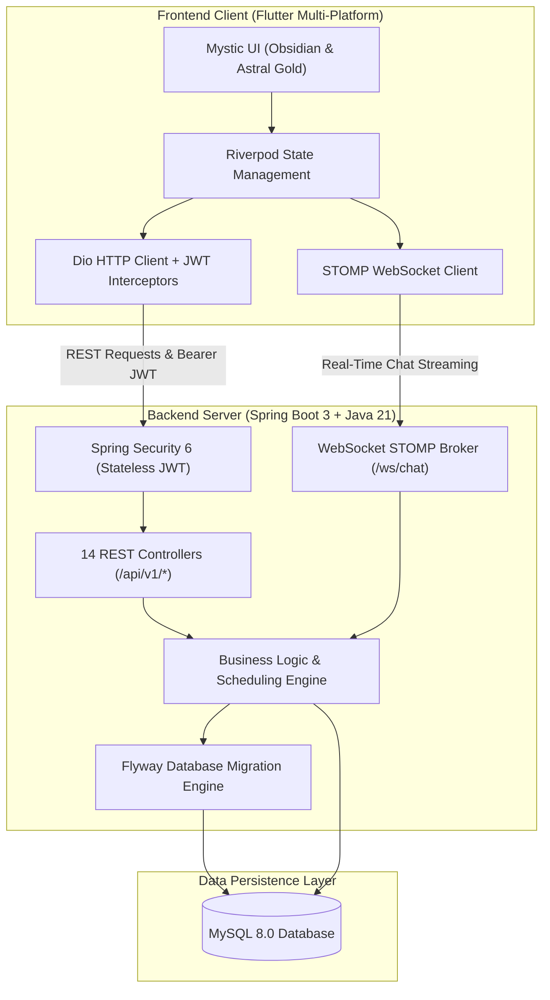

# 🔮 Tarot & Rune Consultation Platform

> A production-grade, full-stack online divination consultation platform featuring real-time video/audio/chat sessions, conflict-free scheduling, server-side price locks, authentic Norse rune casting, interactive Tarot spreads, and comprehensive customer account management.

[](backend)
[](backend)
[](frontend)
[](backend)
[-brightgreen)](.)
[](LICENSE)

---

## 🏛️ System Architecture



---

## ✨ Features Overview

### 🔮 Customer-Facing Mobile & Web App (`/frontend`)
1. **Mystic Design System**: Obsidian Dark (`#0E0B16`) and Astral Ivory Light modes, Card surfaces, Astral Gold accents (`#E5C07B`), and custom typography.
2. **Authentication & Token Lifecycle**: Secure JWT storage, automatic 401 token refresh queue interceptor, Login, Registration, and Forgot Password flows.
3. **Service Discovery**: Categorized catalog (Tarot, Rune, Combo) with server-locked pricing and platform ethical guidelines banner.
4. **Booking Engine**: 14-day calendar strip, conflict-free time slots, question validation, mandatory ethics agreement, and booking cancellation.
5. **Payment Gateway**: Server-side price lock initiation, mock test gateway, UPI/Card/NetBanking options, signature verification, and digital receipts.
6. **Live Consultation Rooms**: Session status headers, elapsed timer, meeting bridge links, and real-time chat with 4s auto-polling.
7. **Reading Outcomes Dossier**: Interactive Tarot card spread viewer, Norse Rune casts with authentic Elder Futhark Unicode glyphs (ᚠ, ᚢ, ᚦ, ᚨ, ᚱ, etc.), and permanent spiritual journal.
8. **Reviews & Ratings**: Interactive 5-star rating picker with descriptive feedback and public reviews listing.
9. **Notification Center**: Chronological notifications list, type-specific icons, and top header dynamic unread badge counter.
10. **Customer Profile & Settings**: Identity card with initials, personal details editor, password change modal (`PUT /api/v1/users/me/password`), and platform ethics code of conduct.

### ⚡ Spring Boot 3 Backend (`/backend`)
* **REST APIs**: 14 REST Controllers covering Auth, Users, Services, Bookings, Availability, Payments, Sessions, Chat, Readings, Reviews, Notifications, and Admin BI.
* **Security**: Spring Security 6 with stateless JWT Bearer token authentication, BCrypt password hashing, and role-based access control (`CUSTOMER`, `READER`, `ADMIN`).
* **Flyway Migrations**: Automated database schema initialization (`V1__init_schema.sql`) and seed data (`V2__seed_initial_data.sql`).
* **Documentation**: Built-in Swagger UI and OpenAPI 3.0 specs at `/swagger-ui/index.html`.
* **Real-time WebSockets**: STOMP message broker (`/ws/chat`, `/topic`, `/queue`, `/app`).

---

## 📁 Repository Structure

```
tarot-consultation-platform/
├── backend/                       # Spring Boot 3 + Java 21 REST API
│   ├── src/main/java/com/tarotplatform/
│   │   ├── config/                # SecurityConfig, OpenApiConfig, WebSocketConfig
│   │   ├── controller/            # 14 REST Controllers
│   │   ├── dto/                   # Request & Response DTOs
│   │   ├── entity/                # JPA Database Entities
│   │   ├── repository/            # Spring Data JPA Repositories
│   │   ├── security/              # JWT Provider & Auth Filters
│   │   └── service/               # Core business services
│   ├── src/main/resources/
│   │   ├── application.yml        # Base configurations
│   │   ├── application-dev.yml    # MySQL connection parameters
│   │   └── db/migration/          # Flyway SQL migrations
│   ├── pom.xml
│   └── Dockerfile                 # Containerization for cloud deployment
│
├── frontend/                      # Flutter Customer Application
│   ├── lib/
│   │   ├── core/                  # Theme, Router, Dio Client, Interceptors
│   │   ├── models/                # 20+ Data Models & DTOs
│   │   └── features/              # 8 Feature Modules (Auth, Booking, Session, etc.)
│   ├── test/                      # 86 automated unit tests
│   └── pubspec.yaml
│
└── tarot-platform.code-workspace  # Multi-root VS Code workspace file
```

---

## 🚀 Local Development Quickstart

### Prerequisites
* **Java 21+** (JDK 21 or JDK 25)
* **Maven 3.9+** (or use included `./mvnw`)
* **Flutter SDK 3.20+**
* **MySQL 8.0+**

### 1. Database Setup
Ensure MySQL is running on port `3306`:
```bash
# Using Docker (Quickest)
docker run -d --name tarot-mysql -p 3306:3306 -e MYSQL_ROOT_PASSWORD=root -e MYSQL_DATABASE=tarot_db mysql:8
```

### 2. Start Backend Server
```bash
cd backend
./mvnw spring-boot:run
```
* **Backend API**: `http://localhost:8080`
* **Swagger UI**: `http://localhost:8080/swagger-ui/index.html`

### 3. Start Frontend App
```bash
cd frontend
# Run in Chrome Web Browser
flutter run -d chrome --web-port=3000

# Or run on macOS Desktop
flutter run -d macos
```
* **Frontend Web App**: `http://localhost:3000`

---

## 🧪 Test Suite

Both projects include comprehensive automated test suites with **100% pass rates**:

```bash
# Test Backend (51 tests)
cd backend && ./mvnw test

# Test Frontend (86 tests)
cd frontend && flutter test
```
* **Total Automated Tests**: **137 / 137 passing (100%)**

---

## 🔑 Pre-Seeded Test Credentials

| Email | Password | Role | Description |
| :--- | :--- | :--- | :--- |
| `customer@tarotplatform.com` | `Password@123` | `CUSTOMER` | Regular Seeker account |
| `reader@tarotplatform.com` | `Password@123` | `READER` | Master Tarot & Rune Reader |
| `admin@tarotplatform.com` | `Password@123` | `ADMIN` | Platform Administrator |

---

## 🌐 Deployment

* **Backend**: Ready to deploy on **Render** using the included `backend/Dockerfile`.
* **Frontend**: Ready to deploy on **Vercel** (`flutter build web --release`).
* **Database**: Ready for **Aiven for MySQL**, **Railway**, or AWS RDS.

---

## 📄 License
This project is licensed under the MIT License.
